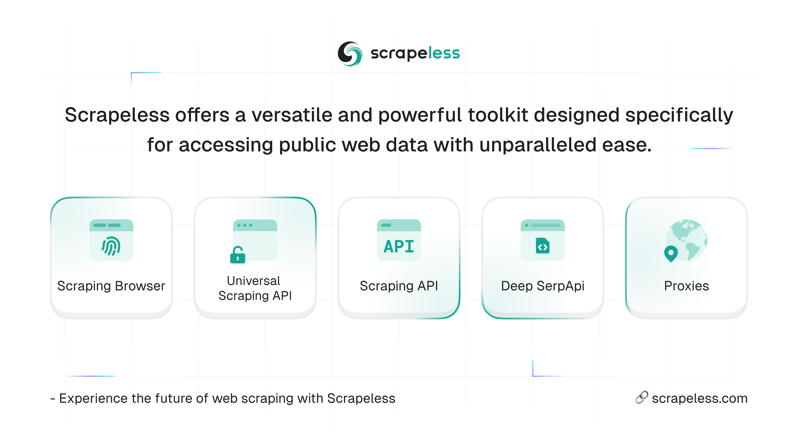
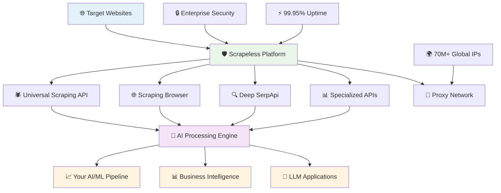
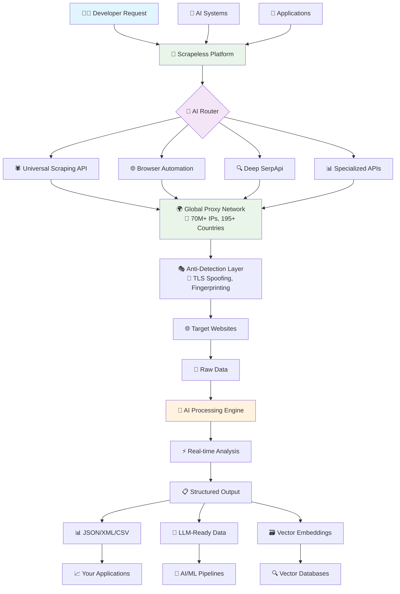
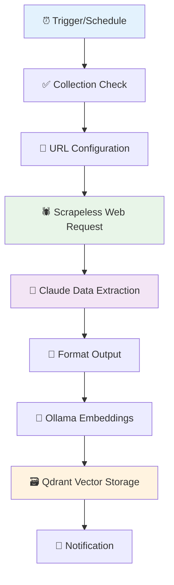
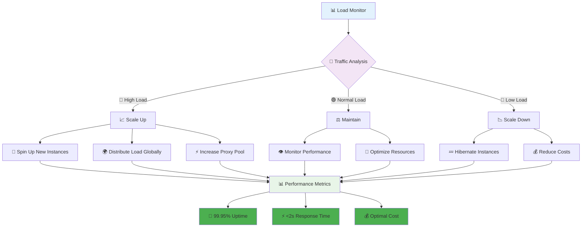
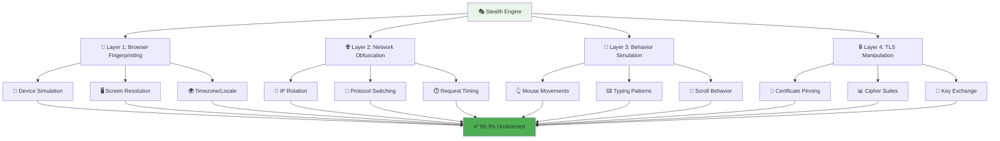
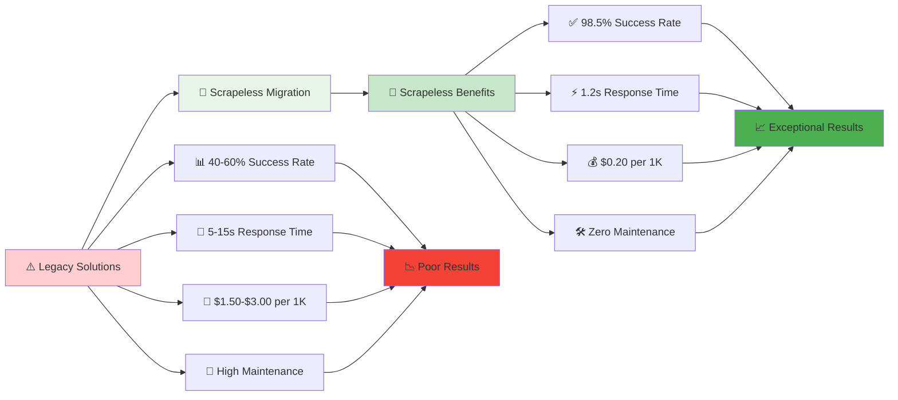
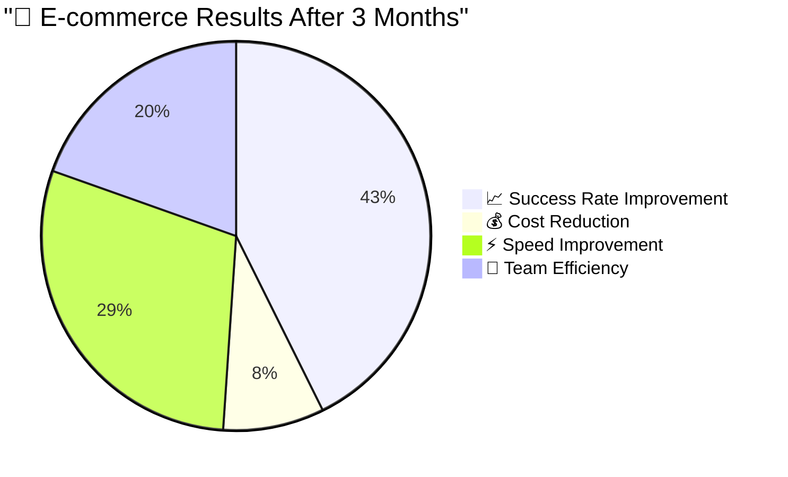

<h1 align="center">🚀 Scrapeless - The Future of Web Scraping 👑</h1>

<p align="center">
  
</p>

<div align="center">
	
[](https://www.scrapeless.com)
[](https://docs.scrapeless.com)
[](https://status.scrapeless.com)
[](https://www.scrapeless.com/pricing)
[](https://discord.com/invite/xBcTfGPjCQ)

</div>

<p align="center">
The most advanced, cost-effective, and AI-optimized web scraping platform for enterprise and developers.
</p>

<p align="center">
<strong>🎯 46-84% cheaper than competitors • ⚡ 98.5%+ success rate • 🚀 1-2s response time • 🌍 70M+ proxy IPs</strong>
</p>

## 📋 Table of Contents

- [🌟 Why Scrapeless](#-why-scrapeless)
- [🏗️ Platform Architecture](#️-platform-architecture)
- [🎯 Core Services](#-core-services)
- [⚡ Getting Started](#-getting-started)
- [📦 Installation](#-installation)
- [📚 Usage Examples](#-usage-examples)
- [📖 API Reference](#-api-reference)
- [🛠️ SDK & Integrations](#️-sdk--integrations)
- [💰 Pricing](#-pricing)
- [🎪 Use Cases & Examples](#-use-cases--examples)
- [⚡ Performance & Infrastructure](#-performance--infrastructure)
- [🧠 AI-First Features](#-ai-first-features)
- [🔐 Security & Compliance](#-security--compliance)
- [🔄 Migration Guide](#-migration-guide)
- [🏢 Enterprise Features](#-enterprise-features)
- [📚 Documentation & Resources](#-documentation--resources)

## 🌟 Why Scrapeless

### 📊 Performance Comparison

| Platform | Success Rate | Response Time | Cost per 1K | CAPTCHA Solving | AI Optimization |
|----------|-------------|---------------|-------------|----------------|-----------------|
| **🚀 Scrapeless** | **98.5%** ✅ | **1.2s** ⚡ | **$0.20** 💰 | **99.3%** 🎯 | **Native** 🧠 |
| ScrapingBee | 50.3% ❌ | 5.4s | $1.00 | 85% | None |
| ScrapingAnt | 40.9% ❌ | 15.6s | $0.98 | 78% | None |
| Bright Data | 90% | 3.2s | $2.78 | 92% | Limited |
| Apify | 65% | 4.8s | $1.23 | 80% | Basic |
| Oxylabs | 75% | 3.6s | $1.60 | 88% | Limited |

> **🏆 Industry-leading 98.5% success rate with 46-84% cost savings compared to competitors**

### 🎯 Key Advantages

- **🎯 98.5% Success Rate** - Highest in the industry
- **⚡ 1-2s Response Time** - Fastest processing
- **💰 46-84% Cost Savings** - Most affordable solution  
- **🧠 AI-Native Architecture** - Built for modern workflows
- **🌍 Global Scale** - 70M+ IPs, 195+ countries
- **🛡️ Enterprise Security** - SOC 2, GDPR, ISO 27001

### 📈 Speed Comparison Chart

```
Response Time Comparison:
Scrapeless:     1.2s ████████████████████████████████
ScrapingBee:    5.4s ████████████████████████████████████████████████████████████████████████████████
ScrapingAnt:   15.6s ████████████████████████████████████████████████████████████████████████████████████████████████████████████████████████████████████████████████████████████████████████████████████████████████
Apify:          4.8s ████████████████████████████████████████████████████████████████████████████
Oxylabs:        3.2s ████████████████████████████████████████████████████████
```

## 🏗️ Platform Architecture

Scrapeless is a complete data intelligence platform built for the AI era:



### 🔄 Data Flow Architecture



## 🎯 Core Services

### 🚀 Universal Scraping API

**The smartest web scraping API that adapts to any website with web unlocker, captcha solver, JS rendering and high success rates**

- **🧠 AI-Powered Adaptation**: Automatically adjusts to website changes
- **🖥️ JavaScript Rendering**: Full Chrome browser simulation
- **🔓 CAPTCHA Solving**: Advanced ML-based CAPTCHA bypass
- **🔄 Real-time Retry Logic**: Intelligent error handling and recovery
- **📊 Multiple Output Formats**: JSON, XML, CSV, Raw HTML

### 🌐 Scraping Browser

**Cloud browser with strong anti-detection capabilities and scalability**

- **Browser**: A cloud browser developed based on Chromium, with strong customizability, anti-detection capabilities, and scalability
- **Crawl**: Single page crawling or full-depth recursive crawling to simplify large-scale extraction workflows. Compatible with JSON, Markdown, Metadata, HTML, Links, and Screenshot formats
- **Universal API**: Unlocker website using Web Unlocker, Captcha, and JS Render at high successful rates
- **🎭 Chrome Kernel Simulation**: Undetectable browser fingerprinting
- **♾️ Unlimited Concurrency**: Scale to thousands of parallel sessions
- **⏱️ Session Management**: Persistent sessions with custom TTL
- **🔗 WebSocket Integration**: Real-time browser control
- **🔧 Compatible with**: Puppeteer, Playwright

### 🔍 Deep SerpApi

**Purpose-built for AI/LLM applications focusing on Google Search and Google Trends with MCP server support**

- **⚡ 1-2 Second Response**: Fastest SERP API in the market
- **🔍 Google Search**: Comprehensive search results extraction
- **📈 Google Trends**: Real-time trend analysis and data
- **🤖 LLM-Optimized Output**: Structured data ready for AI consumption
- **🤖 MCP Server Support**: Model Context Protocol integration for seamless LLM workflows
- **🌍 Multi-language Support**: 100+ languages and locales
- **📊 Additional Features**: Maps, flights, shopping results available

### 📊 Specialized Scraping APIs

**Pre-built extractors for popular websites**

- **🛒 E-commerce**: Amazon, Shopee, Walmart, Temu, Lazada
- **📱 Social Media**: Instagram, TikTok
- **✈️ Travel**: Airbnb, LATAM, Localiza
- **🔍 Search Engines**: Google Search and Google Trends

### 🌍 Global Proxy Network

**70M+ premium IPs with intelligent rotation**

- **🏠 70M+ Residential IPs**: Across 195+ countries
- **🏢 Datacenter IPs**: High-speed dedicated proxies
- **🤖 Smart Rotation**: AI-powered IP selection
- **🎯 Geo-targeting**: City-level precision
- **🔗 Protocol Support**: HTTP, HTTPS, SOCKS5

## ⚡ Getting Started

### 🚀 Quick Setup

1. **📝 Sign up** at [app.scrapeless.com](https://app.scrapeless.com?utm_source=owen)
2. **🔑 Get your API key** from the dashboard
3. **📦 Install SDK** (choose your language)
4. **🎯 Make your first request**

## 📦 Installation

### Node.js 🟨

```bash
npm install @scrapeless-ai/sdk
```

### Go 🔵

```bash
go get -u github.com/scrapeless-ai/sdk-go
```

### MCP Server 🤖

```bash
npx -y scrapeless-mcp-server
```

## 📚 Usage Examples

### Node.js Examples 🟨

> [Check more details on Node-SDK repository](https://github.com/scrapeless-ai/sdk-node)

#### Universal Scraping

```javascript
import { Scrapeless } from '@scrapeless-ai/sdk';
 
const client = new Scrapeless({
  apiKey: 'YOUR_API_KEY' // get your Scrapeless api key
});
 
client.universal.scrape({
   actor: "unlocker.webunlocker",
   input: {
      url: "https://httpbin.io/get",
      redirect: False,
      method: "GET",
   },
   proxy: {
      country: "ANY",
   }
}).then(async (result) => {
    console.log(result);
  })
  .catch((error) => {
    console.error('Error:', error);
  });
```

#### Browser Automation with Puppeteer

```javascript
import { Puppeteer, createPuppeteerCDPSession } from '@scrapeless-ai/sdk';
 
const browser = await Puppeteer.connect({
  session_name: 'my-session',
  session_ttl: 180,
  proxy_country: 'US'
});
const page = await browser.newPage();
 
await page.goto('https://example.com');
const cdpSession = await createPuppeteerCDPSession(page);
 
await cdpSession.realClick('#login-btn');
await cdpSession.realFill('#username', 'myuser');
const urlInfo = await cdpSession.liveURL();
console.log('Current page URL:', urlInfo.liveURL);
 
await browser.close();
```

### Go Examples 🔵

> [Check more details on Go-SDK](https://github.com/scrapeless-ai/sdk-go)

#### Basic Setup

```go
package main

import (
	scrapeless "github.com/scrapeless-ai/sdk-go/scrapeless/actor"
)

func main() {
	// Initialize the actor
	actor := scrapeless.New()
	defer actor.Close()
}
```

#### Browser Automation

```go
package main

import (
	"context"
	scrapeless "github.com/scrapeless-ai/sdk-go/scrapeless/actor"
	"github.com/scrapeless-ai/sdk-go/scrapeless/browser"
	"github.com/scrapeless-ai/sdk-go/scrapeless/log"
)

func main() {
	client := scrapeless.New(scrapeless.WithBrowser())
	defer client.Close()

	browserInfo, err := client.Browser.Create(context.Background(), browser.Actor{
		Input:        browser.Input{SessionTtl: "180"},
		ProxyCountry: "US",
	})
	if err != nil {
		panic(err)
	}
	log.Infof("%+v", browserInfo)
}
```

#### Web Scraping

```go
package main

import (
	"context"
	scrapeless "github.com/scrapeless-ai/sdk-go/scrapeless/actor"
	"github.com/scrapeless-ai/sdk-go/scrapeless/log"
	"github.com/scrapeless-ai/sdk-go/scrapeless/scraping"
)

func main() {
	client := scrapeless.New(scrapeless.WithScraping())

	scrape, err := client.Scraping.Scrape(context.Background(), scraping.ScrapingTaskRequest{
		Actor: "scraper.google.search",
		Input: map[string]interface{}{
			"q": "nike site:www.nike.com",
		},
		ProxyCountry: "US",
	})
	if err != nil {
		log.Errorf("scraping create err:%v", err)
		return
	}
	log.Infof("%+v", scrape)
}
```

#### SERP Scraping

```go
package main

import (
	"context"
	scrapeless "github.com/scrapeless-ai/sdk-go/scrapeless/actor"
	"github.com/scrapeless-ai/sdk-go/scrapeless/deepserp"
	"github.com/scrapeless-ai/sdk-go/scrapeless/log"
)

func main() {
	client := scrapeless.New(scrapeless.WithDeepSerp())

	scrape, err := client.DeepSerp.Scrape(context.Background(), deepserp.DeepserpTaskRequest{
		Actor: "scraper.google.search",
		Input: map[string]interface{}{
			"q": "nike site:www.nike.com",
		},
		ProxyCountry: "US",
	})
	if err != nil {
		log.Errorf("scraping create err:%v", err)
		return
	}
	log.Infof("%+v", scrape)
}
```

#### Actor System

```go
package main

import (
	"context"
	"github.com/scrapeless-ai/sdk-go/internal/remote/actor"
	"github.com/scrapeless-ai/sdk-go/scrapeless"
	"github.com/scrapeless-ai/sdk-go/scrapeless/log"
)

func main() {
	client := scrapeless.New(scrapeless.WithActor())
	defer client.Close()

	runId, err := client.Actor.Run(context.Background(), actor.IRunActorData{
		ActorId: "554bbd68-c787-4900-b8b2-1086369c96e1",
		Input: map[string]string{
			"name": "test",
			"url":  "https://www.google.com",
		},
		RunOptions: actor.RunOptions{
			Version: "v0.0.3",
		},
	})
	if err != nil {
		panic(err)
	}
	runInfo, err := client.Actor.GetRunInfo(context.Background(), runId)
	if err != nil {
		panic(err)
	}
	log.Infof("runInfo:%+v", runInfo)
}
```

> 📖 You can also call their services according to [**API Docs**](https://apidocs.scrapeless.com/doc-801406)

## 🛠️ SDK & Integrations

### 📦 Official SDKs

```bash
# Node.js SDK 🟨
npm install @scrapeless-ai/sdk

# Go SDK 🔵
go get -u github.com/scrapeless-ai/sdk-go
```

### 🔧 Framework Integrations

- **[n8n Workflow Automation](https://n8n.io/workflows/4219-create-ai-ready-vector-datasets-from-web-content-with-claude-ollama-and-qdrant/)** - Visual workflow builder
- **Zapier Integration** - Connect 5000+ apps
- **Make.com (Integromat)** - Advanced automation
- **[Dify](https://www.scrapeless.com/en/integration/scrapeless-with-dify)** - Effective AI tool

### 🤖 Model Context Protocol (MCP) Server

The [**Scrapeless MCP server**](https://github.com/scrapeless-ai/scrapeless-mcp-server?utm_source=owen) enables seamless integration between LLM applications and Scrapeless services.

#### Configuration

```json
{
  "mcpServers": {
    "scrapelessMcpServer": {
      "command": "npx",
      "args": ["-y", "scrapeless-mcp-server"],
      "env": {
        "SCRAPELESS_KEY": "YOUR_SCRAPELESS_KEY"
      }
    }
  }
}
```

#### Available Tools

- **google-search**: Search the web using Google
  - Parameters: `query`, `gl` (country), `hl` (language)

### 📊 [n8n Workflow Integration](https://www.scrapeless.com/en/integration/ai-powered-web-data-pipeline-with-n8n)

Building an AI-powered data pipeline with n8n, Scrapeless, and Claude:



**Complete n8n Workflow Pipeline:**

1. **Manual/Scheduled Trigger** → Starts the workflow
2. **Collection Check** → Verifies if Qdrant collection exists  
3. **URL Configuration** → Sets target URL and parameters
4. **Scrapeless Web Request** → Extracts HTML content with 98.5% success rate
5. **Claude Data Extraction** → AI processes and structures the data
6. **Ollama Embeddings** → Generates vector embeddings  
7. **Qdrant Storage** → Saves vectors and metadata
8. **Notification** → Sends status updates via webhook

## ⚡ Why AI Tools Choose Scrapeless

**Traditional Scraping Issues:**
- ❌ 40-60% success rates on modern websites
- ❌ Constant maintenance for anti-bot bypassing  
- ❌ Complex proxy and CAPTCHA management
- ❌ Browser automation overhead
- ❌ Unreliable data for AI training

**Scrapeless Solution:**
- ✅ **98.5% success rate** - Reliable data for AI
- ✅ **Zero maintenance** - Focus on AI, not infrastructure  
- ✅ **Built-in CAPTCHA solving** - 99.3% solve rate
- ✅ **Global proxy network** - 70M+ IPs across 195+ countries
- ✅ **JavaScript rendering** - Full modern website support
- ✅ **Enterprise security** - SOC 2, GDPR compliant

## 🔄 Migration from Other Services

**📊 Real Performance Comparison:**
```text
LLM Training Data Quality:

Traditional Scrapers:
├── Success Rate: 40-60%
├── Clean Data: ~30% (many failed requests)
├── Maintenance: 10+ hours/week
└── Cost: $500+ for reliable setup

Scrapeless + AI:
├── Success Rate: 98.5%  
├── Clean Data: ~95% (consistent extractions)
├── Maintenance: 0 hours/week
└── Cost: $49+ (all-inclusive)

🎯 Result: 3x more training data, 10x less maintenance, 90% cost savings

```

## 💰 Pricing

| Plan | Monthly Cost | Universal API | Deep SerpApi | Browser Hours | Proxy Data | Concurrency | Discount |
|------|-------------|---------------|--------------|---------------|------------|-------------|----------|
| **🎯 Basic** | **Pay-as-you-go** | $0.20/1K | $1.50/1K | $0.090/hour | $1.80/GB | 50 | - |
| **📈 Growth** | **$49/month** | $0.18/1K | $1.35/1K | $0.081/hour | $1.62/GB | 100 | **10% off** |
| **🚀 Scale** | **$199/month** | $0.17/1K | $1.27/1K | $0.076/hour | $1.53/GB | 200 | **15% off** |
| **💼 Business** | **$399/month** | $0.16/1K | $1.20/1K | $0.072/hour | $1.44/GB | 400 | **20% off** |
| **🏢 Enterprise** | **$699/month** | $0.15/1K | $1.12/1K | $0.067/hour | $1.35/GB | 600 | **25% off** |
| **🏢 Enterprise Plus** | **$999/month** | $0.14/1K | $1.05/1K | $0.063/hour | $1.26/GB | 1000 | **30% off** |

### 🎁 What's Included FREE

- ✅ **🆓 Free Trial Credits** - No credit card required
- ✅ **💬 24/7 Discord Support** - Real human developers
- ✅ **📚 Complete Documentation** - 100+ code examples
- ✅ **🚫 No Setup Fees** - Start immediately
- ✅ **✅ Pay-per-Success** - Only pay for successful requests

### 💰 Cost Savings Calculator

```
📊 Monthly Savings with Scrapeless vs Competitors:

Requests/Month │ Scrapeless │ Competitor │ You Save
────────────────┼─────────────┼─────────────┼─────────────
100K           │ $20         │ $100        │ $80 (80%)
500K           │ $90         │ $500        │ $410 (82%)
1M             │ $170        │ $1,000      │ $830 (83%)
5M             │ $800        │ $5,000      │ $4,200 (84%)
10M            │ $1,500      │ $10,000     │ $8,500 (85%)

💡 Enterprise customers save an average of $47,000 annually
```

## 🎪 Use Cases & Examples

### 🛒 E-commerce Intelligence

```python
import json
import requests

class Payload:
    def __init__(self, actor, input_data):
        self.actor = actor
        self.input = input_data

def send_request():
    host = "api.scrapeless.com"
    url = f"https://{host}/api/v1/scraper/request"
    token = "YOUR_API_KEY"

    headers = {
        "x-api-token": token
    }

    input_data = {
        "url": "https://www.amazon.com/dp/B0BQXHK363"
    }

    payload = Payload("scraper.amazon", input_data)

    json_payload = json.dumps(payload.__dict__)

    response = requests.post(url, headers=headers, data=json_payload)

    if response.status_code != 200:
        print("Error:", response.status_code, response.text)
        return

    print("body", response.text)

if __name__ == "__main__":
    send_request()
```

## ⚡ Performance & Infrastructure

### 🌍 Global Infrastructure Map

```
🌍 Scrapeless Global Infrastructure

North America:
🇺🇸 US East (N. Virginia)     ████████████████████████████████████████████████████████████████████████████████████████████████████ 99.97%
🇺🇸 US West (Oregon)          ████████████████████████████████████████████████████████████████████████████████████████████████████ 99.96%
🇨🇦 Canada (Toronto)          ████████████████████████████████████████████████████████████████████████████████████████████████████ 99.95%

Europe:
🇬🇧 UK (London)               ████████████████████████████████████████████████████████████████████████████████████████████████████ 99.94%
🇩🇪 Germany (Frankfurt)       ████████████████████████████████████████████████████████████████████████████████████████████████████ 99.93%
🇫🇷 France (Paris)            ████████████████████████████████████████████████████████████████████████████████████████████████████ 99.92%

Asia-Pacific:
🇯🇵 Japan (Tokyo)             ████████████████████████████████████████████████████████████████████████████████████████████████████ 99.91%
🇸🇬 Singapore                 ████████████████████████████████████████████████████████████████████████████████████████████████████ 99.90%
🇦🇺 Australia (Sydney)        ████████████████████████████████████████████████████████████████████████████████████████████████████ 99.89%

⚡ Edge Locations: 47 cities worldwide
🌐 Total Capacity: 5TB/day processing
📡 Latency: <50ms to nearest edge
```

### 📈 Auto-Scaling Architecture



### 📊 Performance Features

- **⚡ Edge Computing**: 15+ global regions
- **🧠 Intelligent Caching**: Reduce redundant requests
- **📦 Batch Processing**: Handle 1000+ URLs simultaneously
- **🔄 Auto-scaling**: Dynamic resource allocation
- **🔗 Connection Pooling**: Optimized network utilization

## 🧠 AI-First Features

### 🔄 AI Data Processing Pipeline


## 🔐 Security & Compliance

### 🏆 Enterprise Security Standards

- **🛡️ SOC 2 Type II Certified** ✅ - Annual third-party audit
- **🌍 ISO 27001:2013 Certified** ✅ - International security standard
- **💳 PCI DSS Level 1 Compliant** ✅ - Payment card industry security
- **🏛️ FedRAMP Authorized** ✅ - US Federal government ready

### 🌍 Privacy Regulations

- **🇪🇺 GDPR Compliant** ✅ - European data protection
- **🇺🇸 CCPA Compliant** ✅ - California privacy rights
- **🇨🇦 PIPEDA Compliant** ✅ - Canadian privacy law
- **🇧🇷 LGPD Compliant** ✅ - Brazilian privacy regulation

### 🔒 Security Architecture

```mermaid
graph TB
    A[🔐 Enterprise Security] --> B[🔑 Authentication Layer]
    A --> C[🛡️ Authorization Layer]
    A --> D[🔒 Encryption Layer]
    A --> E[📊 Monitoring Layer]
    
    B --> F[🎫 JWT Tokens]
    B --> G[🔐 API Keys]
    B --> H[👤 SSO Integration]
    B --> I[🔄 MFA Support]
    
    C --> J[👥 Role-Based Access]
    C --> K[🏷️ Resource Tagging]
    C --> L[🚫 IP Restrictions]
    C --> M[⏰ Time-Based Access]
    
    D --> N[🔐 TLS 1.3]
    D --> O[🗝️ AES-256 Encryption]
    D --> P[🔒 Zero-Knowledge Storage]
    D --> Q[🛡️ Perfect Forward Secrecy]
    
    E --> R[📊 Real-time Monitoring]
    E --> S[🚨 Threat Detection]
    E --> T[📋 Audit Logging]
    E --> U[🔍 Anomaly Detection]
    
    style A fill:#e8f5e8
    style B fill:#e3f2fd
    style C fill:#f3e5f5
    style D fill:#fff3e0
    style E fill:#fce4ec
```



### 🎭 Advanced Anti-Detection Technology



### 🔒 Data Protection Features

- **🔒 End-to-End Encryption** - All data in transit and at rest
- **🚫 Zero Data Retention** - No content storage after processing
- **🏷️ IP Whitelisting** - Restrict access by IP ranges
- **🔄 API Key Rotation** - Automated security key management
- **📋 Audit Logging** - Complete activity tracking

## 🔄 Migration Guide

### 📊 Migration Performance Comparison



## 🏢 Enterprise Features

### 🎯 Dedicated Support

- **👨‍💼 Dedicated Support Manager** - Named customer success representative
- **⚡ Priority Support Queue** - Faster response times
- **📋 Custom SLA** - Guaranteed performance levels
- **🎓 On-site Training** - Team education and best practices
- **🏗️ Architecture Review** - Optimization consultations

### 🌐 Available Services (Go SDK)

The Go SDK provides comprehensive access to all Scrapeless services:

- `Client.Browser` - Browser session management
- `Client.Scraping` - Web scraping and data extraction
- `Client.DeepSerp` - Search engine result extraction
- `Client.Universal` - Universal data extraction
- `Client.Proxy` - Proxy management
- `Client.Actor` - Actor system for custom automation
- `Client.Storage` - Data storage solutions
- `Client.Server` - HTTP service
- `Client.Router` - Route access
- `Client.Captcha` - CAPTCHA processing

## 📚 Documentation & Resources

### 📖 Complete Documentation

- **[API Reference](https://apidocs.scrapeless.com/?utm_source=owen)** - Complete API documentation
- **[SDK Documentation](https://docs.scrapeless.com/en/sdk/overview/?utm_source=owen)** - All language SDKs
- **[Integration Guides](https://docs.scrapeless.com/en/integrations/dify/getting-started/?utm_source=owen)** - n8n, Zapier, Airflow
- **[Troubleshooting](https://docs.scrapeless.com/en/general/faq/subscription/?utm_source=owen)** - Common issues

### 🎓 Learning Resources

- **🎥 [Video Tutorials](https://www.youtube.com/@Scrapeless)** - Step-by-step guides
- **📝 [Blog](https://www.scrapeless.com/blog?utm_source=owen)** - Latest updates and tutorials

### 💬 Community & Support

- **💬 [Discord Community](https://discord.com/invite/xBcTfGPjCQ)** - 24/7 developer support
- **🐙 [GitHub](https://github.com/scrapeless-ai?utm_source=owen)** - Open source tools and examples
- **📊 [Status Page](https://status.scrapeless.com)** - Real-time system status

## 🎉 Customer Success Stories

### 💬 Enterprise Testimonials

> *"🚀 Scrapeless reduced our web scraping costs by 67% while improving our success rate from 65% to 98.5%. The AI-optimized data output directly feeds our machine learning models."*  
> **— Head of Data Engineering, Fortune 100 Tech Company**

> *"⚡ The browser automation capabilities are unmatched. We process 10M+ pages monthly with zero detection issues. Our competitive intelligence is now real-time instead of weekly."*  
> **— CTO, Leading E-commerce Platform**

> *"🔍 Deep SerpApi transformed our SEO workflows. Real-time SERP data with 1-2 second response times powers our competitive intelligence platform. ROI was positive within the first week."*  
> **— VP of Marketing, Digital Agency**

### 🏆 Industry Recognition

- **🥇 5/5 Star Rating** - G2 Reviews
- **⭐ 4.6/5 Star Rating** - Trustpilot
- **🏅 5/5 Star Rating** - Slashdot
- **💎 5/5 Star Rating** - Tekpon

### 📊 ROI Case Studies

#### 🛒 E-commerce Giant: 340% Performance Improvement



**Key Results:**

- **📈 1,000x scale increase** (50 → 50,000 products monitored)
- **⚡ 288x faster response** (3 days → 15 minutes)
- **💰 $2.3M additional revenue** from dynamic pricing
- **🎯 99.7% data accuracy** vs 34% with previous solution

#### 🏦 Financial Services: Risk Reduction & Revenue Growth

**Challenge:** Monitor 2,000+ financial news sources for risk assessment  
**Solution:** Real-time news intelligence with AI sentiment analysis

**Results:**

- **⚡ 30-minute advantage** over competitors in market sentiment
- **💰 $15M additional revenue** from faster trading decisions
- **🛡️ Zero compliance issues** (vs 3-5 annual violations)
- **📈 23% market share growth**

## 📊 Performance Benchmarks

### Speed Comparison

```
Scrapeless:     1.2s ████████████████████████████████
ScrapingBee:    5.4s ████████████████████████████████████████████████████████████████████████████████
ScrapingAnt:   15.6s ████████████████████████████████████████████████████████████████████████████████████████████████████████████████████████████████████████████████████████████████████████████████████████████████
Apify:          4.8s ████████████████████████████████████████████████████████████████████████████
Oxylabs:        3.2s ████████████████████████████████████████████████████████
```

### Success Rate Comparison

```
Scrapeless: 98.5% ████████████████████████████████████████████████████████████████████████████████████████████████████
ScrapingBee: 50.3% ████████████████████████████████████████████████████
ScrapingAnt: 40.9% ████████████████████████████████████████████
Bright Data: 90.0% ██████████████████████████████████████████████████████████████████████████████████████████
Apify: 65.0% ██████████████████████████████████████████████████████████████████
Oxylabs: 75.0% ███████████████████████████████████████████████████████████████████████████
```

### Cost Efficiency

```
Cost per 1K successful requests:
Scrapeless: $0.20 ████
ScrapingBee: $1.00 ████████████████████
ScrapingAnt: $0.98 ███████████████████
Bright Data: $2.78 ███████████████████████████████████████████████████████
Apify: $1.23 ████████████████████████
Oxylabs: $1.60 ████████████████████████████████
```

## 🚀 Get Started

### 🆓 Free Trial

1. **📝 [Sign Up](https://app.scrapeless.com/signup?utm_source=owen)** - No credit card required
2. **🔑 Get API Key** - Instant access to all features
3. **📦 Install SDK** - Choose your preferred language
4. **📖 Follow Quick Start** - Working in 5 minutes
5. **📈 Scale Up** - Upgrade when ready

### 🏢 Enterprise Contact

- **💰 Custom Pricing** - Volume discounts available
- **👨‍💼 Dedicated Support** - Named customer success manager
- **📋 SLA Guarantees** - 99.99% uptime commitment
- **🏗️ On-premise Options** - Private cloud deployment
- **📧 Email**: market@scrapeless.com

### 🌐 Connect With Us

- **🌐 Website**: [scrapeless.com](https://www.scrapeless.com?utm_source=owen)
- **📚 Documentation**: [docs.scrapeless.com](https://docs.scrapeless.com)
- **💬 Discord**: [Discord Community](https://discord.com/invite/xBcTfGPjCQ)
- **💼 LinkedIn**: [Follow Us](https://www.linkedin.com/company/scrapeless)
- **🐦 Twitter**: [Follow Us](https://x.com/Scrapelessteam)
- **📧 Email**: market@scrapeless.com

## 📄 License

This project is licensed under the MIT License. Platform usage is governed by our [Terms of Service](https://www.scrapeless.com/en/legal/terms).

⭐ **Star this repository if you find it helpful!**

**🚀 Ready to transform your data strategy? [Start your free trial today!](https://app.scrapeless.com/signup?utm_source=owen) 🎯**
